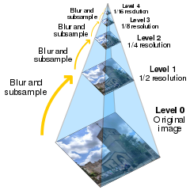

## Deep Zoom Image Demo using Solid JS

Create my own `Deep Zoom Image` using `Tile Pyramid` that was develop by Microsoft for Silverlight in 2008.
Today in Javascript tile pyramid mainly for TileMap, including Google Maps.
And the most popular tile pyramid framework in Javascript is [Open Seadragon](https://openseadragon.github.io/).

I challange my self to create my own for my personal project using `solid-js` with `vite-js`.

*) Tile Pyramid illustration by [Cmglee](https://commons.wikimedia.org/wiki/User:Cmglee)
